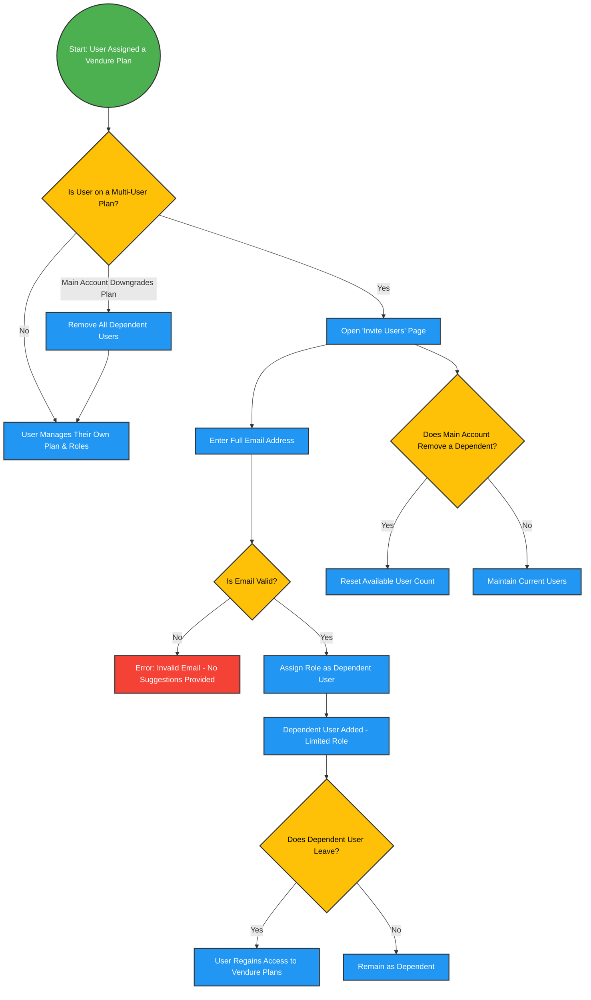

## **1. Overview**  

This **multi-user extension** extends **Vendure**, which is responsible for **managing plans and dynamically updating user roles based on their plan subscription.**  

- **Vendure is the system where all plans are registered and updated.**  
- **A user’s role is determined by their current plan.**  
- **Saleor is only used for selling kits**; purchasing a kit **does not** automatically enroll a user in Vendure.  
- **Users must register their kit to be added to Vendure, where they are assigned an initial plan and role.**  

This extension introduces **multi-user management**, allowing a **Main Account Holder** to invite **dependent users** based on their **Vendure plan limits**.  

- **Upgrading or downgrading a plan in Vendure updates the user's role accordingly.**  
- **Dependent users have limited access based on their assigned role.**  
- **To regain full access to a plan’s management system, a dependent user must remove themselves from dependency.**  

---

## **2. Core Functionalities**  

### **2.1 Kit Registration & Plan Activation in Vendure**  

1. **Kit Purchase in Saleor**  
   - Kits are sold through **Saleor**, but purchasing alone does **not** link the user to Vendure.  
   - The user must **register their kit** to be **added to Vendure**.  

2. **Kit Registration & Vendure Plan Assignment**  
   - When a user **registers their kit via the QR code app**, they are **added to Vendure** and assigned an **initial plan.**  
   - The system **updates the user’s role** according to their assigned plan.  
   - The **Plans tab becomes visible**, allowing the user to view and manage available plans.  

---

### **2.2 Upgrading to a Multi-User Plan**  

1. **Main Account Becomes Multi-User**  
   - If a user **upgrades their plan in Vendure**, their **role is updated automatically.**  
   - A **Multi-User Plan** grants the ability to **invite dependent users**.  
   - The **Plans tab remains visible** to the **Main Account Holder**.  

2. **Inviting Dependent Users**  
   - The **Main Account Holder** can invite dependent users through an **"Invite Users" page**.  
   - Invitations require the **manual entry of a full email address**.  
   - **No email suggestions** are provided to prevent unintended invitations.  
   - The Main Account Holder can:  
     - **View a list** of invited users.  
     - **Remove dependent users**, which resets the available user count.  

3. **Dependent Users & Role Restrictions**  
   - Dependent users receive a **restricted role in Vendure**, determined by the Main Account Holder’s plan.  
   - **They do not have access to the plan management system for the specific plan they are dependent on.**  
   - They can **only view their profile and the Main Account Holder** but **cannot see other dependent users**.  

---

### **2.3 Downgrading or Removing Dependents**  

1. **Main Account Downgrade**  
   - If the **Main Account Holder downgrades**, their **Vendure plan is updated**, and their **role changes accordingly.**  
   - If the downgraded plan **no longer supports dependent users**, all dependents are **automatically removed.**  

2. **Dependent Users Leaving the Multi-User Plan**  
   - A **dependent user can voluntarily remove themselves** from the plan.  
   - **Upon leaving, their role in Vendure is updated**, and they regain full access to the plan management system they were previously restricted from.  

3. **Plan-Specific Restrictions**  
   - **The restriction only applies to the specific plan where the user is a dependent.**  
   - **Other Vendure plans remain accessible** to the user.  

---

## **3. User Permissions & Visibility**  

| Feature | **Main Account Holder** | **Dependent User** |
|---------|------------------------|--------------------|
| Can see & manage Vendure Plans | ✅ | ❌ |
| Can upgrade/downgrade plans (updates role) | ✅ | ❌ |
| Can invite users | ✅ | ❌ |
| Can remove invited users | ✅ | ❌ |
| Can leave the dependent role | ❌ | ✅ |
| Can see other dependent users | ❌ | ❌ |
| Can see the Main Account Holder | ✅ | ✅ |
| Can access other plans (not linked to dependency) | ✅ | ✅ |

